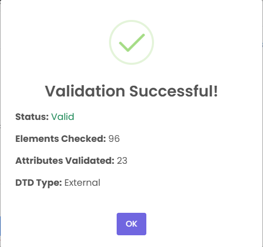
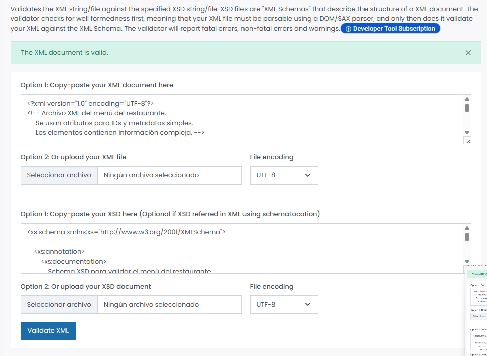

# Validación del archivo menu.xml

En este documento explicamos de forma simple cómo comprobamos que nuestro archivo `menu.xml` funciona bien y cumple las reglas del DTD y del XSD.

---

## 1. Herramientas utilizadas

### Validación DTD
- **Herramienta:** XMLValidation.com  
- **Versión:** No tiene versión, es una página web.

### Validación XSD
- **Herramienta:** FreeFormatter XML XSD Validator  
- **Versión:** Tampoco tiene versión, es online.

Estas dos páginas sirven para comprobar si el XML está bien hecho y si sigue las normas que le hemos puesto.

---

## 2. Validación contra DTD

### Pasos que seguimos:

1. Entramos en **XMLValidation.com**.
2. Pegamos o subimos el archivo `menu.xml`.
3. Subimos también el archivo `menu.dtd`.
4. Le dimos al botón de validar.
5. La página nos dijo que **todo estaba correcto**.

### Captura de pantalla:

---

## 3. Validación contra XSD

### Pasos que seguimos:

1. Entramos en **FreeFormatter XML Validator (XSD)**.
2. Subimos `menu.xml`.
3. Subimos `menu.xsd`.
4. Pulsamos validar.
5. La herramienta confirmó que **el XML cumple todas las reglas del XSD**.

### Captura de pantalla:

---

## 4. Decisiones de diseño

### ¿Por qué usamos atributos?
- Para cosas pequeñas y simples, como:
  - `id` → porque es un identificador.
  - `disponible` → porque solo puede ser “true” o “false”.
  - `fechaPublicacion` → porque es un dato del menú, no del contenido.

### ¿Por qué usamos elementos?
- Para cosas que tienen más contenido o pueden repetirse:
  - `nombre`, `precio`, `descripcion`
  - `categorias` y `alergenos` (porque pueden tener varios valores)
  - `fechaRegistro`

En resumen:  
**Atributos = datos pequeños**  
**Elementos = contenido importante o repetible**

---

## 5. Restricciones del XSD y por qué las pusimos

1. **Precios entre 1 y 200**  
   Para que no haya precios absurdos.

2. **Máximo 2 decimales en el precio**  
   Porque los precios reales funcionan así.

3. **Descripciones con un mínimo de 10 caracteres**  
   Para evitar textos demasiado cortos.

4. **Enumeración para “disponible”**  
   Solo puede ser “true” o “false”, nada más.

5. **ID único para cada plato**  
   Para que no haya dos platos con el mismo identificador.

---

## 6. Conclusiones

El XML pasó las dos validaciones sin errores.  
Durante el proceso tuvimos que ajustar algunas cosas:

- Asegurarnos de que las fechas tenían el formato correcto.
- Revisar que todos los precios respetaran las reglas del XSD.
- Añadir `minOccurs="0"` para permitir platos sin alérgenos.

Después de estos cambios, todo funcionó perfectamente.

